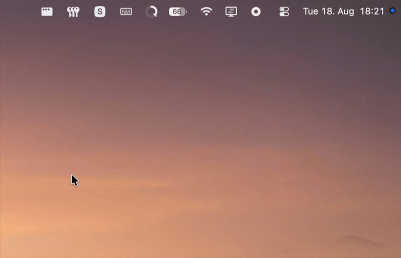

# Cleankey: Lock Your Keyboard to Clean It (macOS Menu Bar App)

**Cleankey is a tiny, free macOS menu bar app that temporarily locks your keyboard so you can wipe down the keys without triggering accidental keystrokes.** Flip the toggle on, clean at your leisure, flip it off. That's it.

---

## Why Cleankey?

Wiping down a Mac keyboard normally fires off a storm of keystrokes. Apps open, text disappears, the volume jumps, shortcuts fire. Cleankey blocks **all** keyboard input system-wide with a single toggle, so you can clean safely.

- **Lock your keyboard instantly**, one click in the menu bar
- **Blocks every key**: letters, numbers, modifiers (⌘ ⌥ ⌃ ⇧), and media keys (volume, brightness, play/pause)
- **Lives in the menu bar**, so there's no Dock icon and no app switcher clutter
- **Instant off.** Everything returns to normal the moment you toggle back
- **Opens at login** if you want it waiting for you
- **Tells you when a new version is out**, without installing anything behind your back
- **Lightweight and native**, built in Swift and SwiftUI

## How it works

Cleankey installs a system-wide event tap at the HID level and catches key events before they reach any app. While blocking is active, Cleankey drops every keystroke, including modifier keys and media keys like play/pause and volume. Toggle it off and everything returns to normal.

Working at the HID level means macOS requires two permissions:

- **Device Control and Data Access** (called **Accessibility** on macOS 26 and earlier) lets Cleankey suppress key events
- **Input Monitoring** lets Cleankey receive them in the first place

Cleankey needs both. With either one missing it cannot block anything. The menu shows a green checkmark or red X beside each permission and provides shortcuts that open the right System Settings pane directly.

## Requirements

- macOS 13.0 (Ventura) or later
- Works on Apple Silicon and Intel Macs

## Languages

Cleankey automatically follows the language macOS selects for the app, including a per-app language chosen in System Settings. The interface supports English, German, French, Spanish, Simplified Chinese, Italian, Russian and Japanese.

## Installation

Two options:
1. Download the .zip archive from the "Releases" section here and drop `Cleankey.app` into `/Applications` (or wherever you want).
2. Download the whole repository, build the project in Xcode and drop `Cleankey.app` into your `/Applications` folder.

### First run

Apple has signed and notarized Cleankey, so it opens normally. macOS asks once to confirm you meant to open something you downloaded.

1. Open Cleankey and click the keyboard icon in the menu bar.
2. Approve both permission prompts, then switch Cleankey on under Accessibility (macOS 13–26) or Device Control and Data Access (macOS 27 and later), and under Input Monitoring.
3. **Quit Cleankey and open it again.** macOS applies new permissions only to a fresh launch, so the toggle keeps failing until you do.

After that the toggle works every time. If it ever refuses to switch on, the menu names the permission that's missing.

Cleankey lives entirely in the menu bar, which means no Dock icon and no app switcher entry. As simple as it gets.

## FAQ

**How do I unlock the keyboard once it's locked?**
Click the Cleankey icon in the menu bar with your mouse or trackpad and flip the toggle off. The mouse keeps working while the keyboard is locked.

**The toggle flips itself back off. What's wrong?**
Cleankey could not create its keyboard event tap, which almost always means macOS has not granted it access yet. The menu says so directly and names the missing permission. Grant Cleankey both permissions using the buttons in the menu, quit the app, and open it again. Replacing the app with a new build resets these grants, and you may have to remove the old Cleankey entry from those lists first.

**Does Cleankey block media and function keys too?**
Yes. Volume, brightness and play/pause keys stay blocked while cleaning mode is on, so wiping the top row won't change your settings.

**Why does Cleankey need two permissions?**
macOS requires both to intercept keyboard events system-wide. Cleankey uses them to drop keystrokes while locking is active. It does not log, store or transmit anything you type.

**Is Cleankey safe? Does it record my keystrokes?**
No. Cleankey drops key events while active and never reads, saves or sends them anywhere.

**Does Cleankey update itself?**
No. "Check for Updates" asks GitHub whether a newer release exists and tells you what it finds. Downloading and replacing the app stays your decision.

**Will it disable my keyboard permanently if the app crashes?**
No. The keyboard lock exists only while Cleankey is running and toggled on. Quitting the app restores normal input immediately.

---

Made by [Nick Ringelmann](https://nickringelmann.com)
